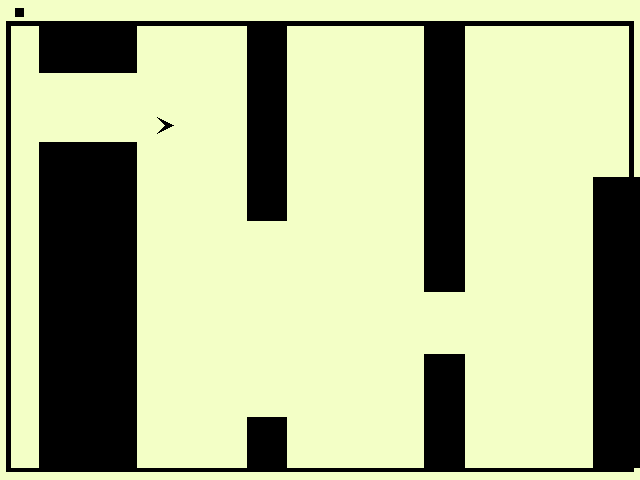

Flappy Bird Adventure !

Author: Xuyang Fang

Design: Add different environments in Flappy birds, including slippery ice, blue seas, muddy ground with high resistence. The gravity in differnt environments are different, and there will be warnings before environment changes.

Screen Shot:

How To Play:

The player controls a bird, attempting to fly between black bars without hitting them. Left click will make the bird go up and right click will make the bird go down. 
The black boxes in the upper left corner are the environments your bird has visited. Let the bird go through as many new environments as possible !

This game was built with [NEST](NEST.md).
